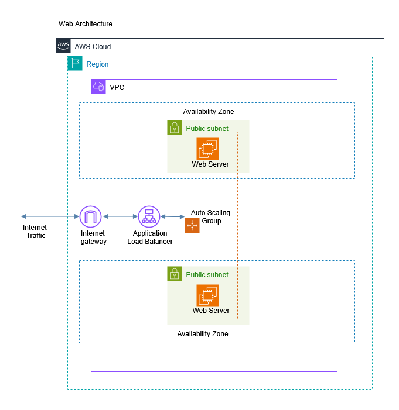

# AWS Terraform Web Infrastructure 

## Overview
This repository contains a Terraform module that provisions a **highly available, scalable, and secure web application infrastructure** on AWS. It's a perfect playground for beginners to understand core AWS services and for practitioners to solidify their Terraform skills.

[](https://www.terraform.io/)
[](https://registry.terraform.io/providers/hashicorp/aws/latest)
[](https://opensource.org/licenses/MIT)

## What You'll Build

By applying this Terraform code, you will create a modern AWS architecture that includes:

*   **A Virtual Private Cloud (VPC):** Your own logically isolated network.
*   **Public Subnets:** Spread across two Availability Zones for high availability.
*   **Security Groups:** Acting as virtual firewalls to control traffic to your ALB and EC2 instances.
*   **An Application Load Balancer (ALB):** To efficiently distribute incoming web traffic.
*   **A Target Group:** To route requests from the ALB to healthy instances.
*   **A Launch Template:** Defining the blueprint for your web servers (Amazon Linux 2023 with Apache Web Server Defined in the **Userdata Script**).
*   **An Auto Scaling Group (ASG):** To automatically maintain and scale the number of healthy web instances.



*(Note: You can create a simple diagram using [Figma](https://www.figma.com/community/file/989585391556898521/aws-cloud-diagram) or [draw.io](https://app.diagrams.net/?splash=0&libs=aws4) and add it to your repo for visual reference!)*

## Project Structure

```bash
aws-terraform-web-infra/
├── main.tf                 # Primary file for resource definitions
├── outputs.tf              # Output values to display after deployment
├── variables.tf            # Variable definitions (for customization)
├── README.md              # This file
```
## Prerequisites

- *Terraform Installed* Download and Install [Terraform](https://www.terraform.io/downloads)
- *AWS CLI configured* Install the [AWS CLI](https://aws.amazon.com/cli/) and run `aws configure` to set up your credentials.
- *An AWS account* [Create one for free here](https://aws.amazon.com/free/)
- *A valid AWS AMI ID*  (Update the `image_id` in the launch template)


## Usage

1. Clone the repository:
   ```bash
   git clone https://github.com/William-Muko/AWS-Terraform-Architecture.git
   cd AWS-Terraform-Architecture
   ```

2. Initialize Terraform:
   ```bash
   terraform init
   ```

3. Review the plan:
   ```bash
   terraform plan
   ```

4. Apply the configuration:
   ```bash
   terraform apply
   ```

5. Confirm when prompted.
   ```
   yes
   ```

## Cleanup

To remove all the resources created:
```bash
terraform destroy
```

## License

This project is licensed under the MIT License, see the [LICENSE](LICENSE) file for details

## Disclaimer 

This infrastructure is for **educational and demonstration purposes**. Always review best practices for security and cost optimization before deploying anything to a production environment.

----

```
This is the end of THE README,  Go touch some grass now!😂
```
----

```
Happy Building! 🤪
```
